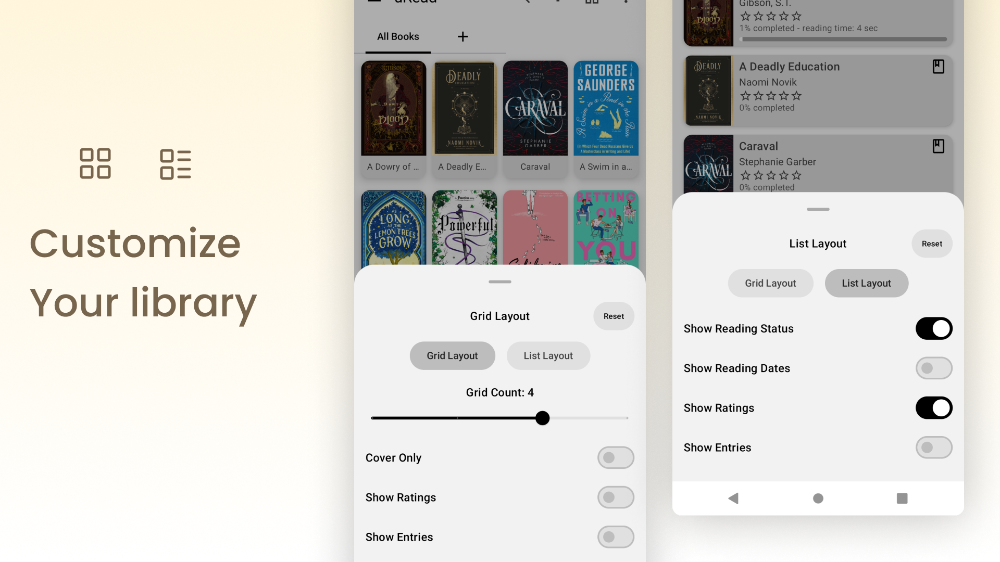

 

<h1 align="center"> uRead </h1>

 

## Android Ebook Reader

An Ebook reader for Android supporting Epub books, implemented in a clean and minimalistic UI in <a target="_blank" href="https://m3.material.io/">Material You</a> style.

 
 
 
 
 
 
 

## Features

- Support for EPUB format
- Material You design
- Color picker functionality
- Room database integration for local storage
- Jetpack Compose UI
- Hilt dependency injection
- Coil for image loading
- Datastore for preferences
- Paging support

## Feature Request

To request a feature for the app, add a new issue with the label [feature](https://github.com/Rics-Dev/uRead/issues/new)

## License

This project is licensed under the GNU General Public License v3.0 - see the [LICENSE](LICENSE) file for details.

## Acknowledgments

- [Readium](https://readium.org/) for their e-book toolkit
- [Skydoves](https://github.com/skydoves) for the ColorPicker Compose library
- [Shivamdhuria](https://github.com/Shivamdhuria) for the Palette library
